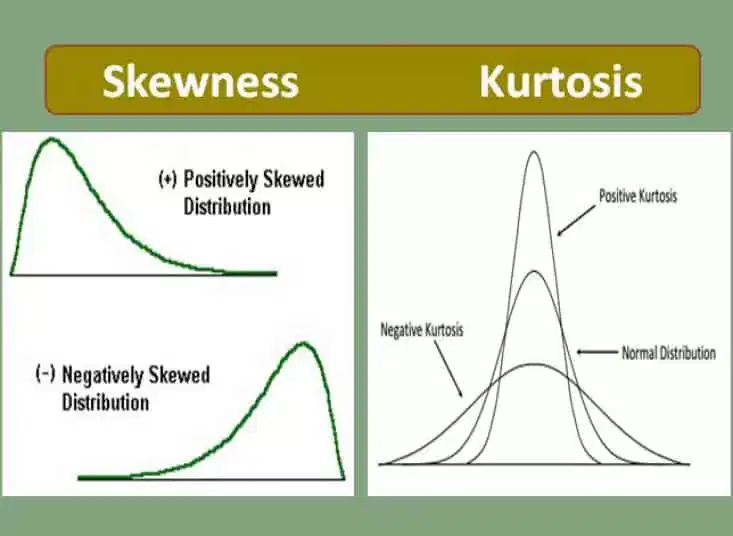
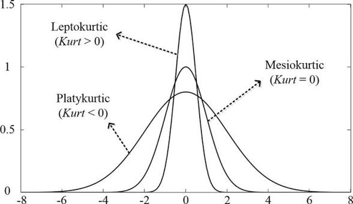

# Rasgos que delatan si los datos siguen Normal o t-Student

## ν — qué es

ν (*nu*) son los **grados de libertad** de la t-Student. Es el único parámetro que controla la forma de la distribución (además de media y escala). Determina qué tan gruesas son las colas:
- ν pequeño → colas muy gruesas (más masa en los extremos)
- ν grande → colas cada vez más finas, convergiendo a la normal cuando ν → ∞

Se estima a partir de los datos (por MLE). En retornos financieros diarios suele caer entre 3 y 8.

---

## 1. Curtosis — el diagnóstico más directo

La normal tiene curtosis teórica = 3 (exceso de curtosis = 0).
La t-Student tiene curtosis = 6/(ν−4) para ν > 4, siempre positiva y creciente al bajar ν.

| ν | Curtosis exceso |
|---|---|
| ∞ (→ normal) | 0 |
| 30 | 0.21 |
| 10 | 1.0 |
| 5 | 6.0 |
| 4 | ∞ |

Curtosis empírica >> 0 → fat tails → t-Student. El valor de la curtosis orienta qué ν encaja.

## 2. Q-Q plot — firma visual de las colas

**Contra la normal:**
- Datos normales → puntos sobre la diagonal
- Datos t-Student → S abierta en ambas colas: las colas observadas están más lejos del centro de lo que la normal predice

**Contra la t-Student (con ν estimado):**
- Si ν es correcto → puntos vuelven a la diagonal
- Si aún se separan → ν mal calibrado

La S en el Q-Q normal es la firma visual de fat tails.

## 3. Skewness — asimetría

- Normal y t-Student estándar: skewness = 0 (ambas simétricas)
- Retornos reales: skewness < 0 (cola izquierda más larga)

Si la skewness es significativamente negativa, ninguna de las dos ajusta perfectamente. La t-Student sigue siendo la mejor elección porque captura fat tails, pero en rigor necesitarías una t asimétrica.

## 4. Pruebas formales y qué miden

| Test | Qué mide | Limitación |
|---|---|---|
| **Jarque-Bera** | Desviación conjunta de skewness=0 y curtosis=3 | En muestras grandes casi siempre rechaza aunque la desviación sea trivial |
| **Shapiro-Wilk** | Correlación entre datos y cuantiles normales | Más potente en muestras pequeñas (<5000) |
| **Kolmogorov-Smirnov** | Distancia máxima entre CDF empírica y CDF teórica | Más sensible al centro que a las colas — el peor para detectar fat tails |

Para elegir entre normal y t-Student, JB es el más informativo: si el p-valor bajo viene de curtosis alta (no de skewness), señala directamente fat tails → t-Student.

## 5. Estimación de ν por MLE como diagnóstico cuantitativo

- ν > 30 → prácticamente indistinguible de una normal
- ν ∈ [5, 10] → colas moderadas, típico en retornos diarios de índices
- ν < 5 → colas muy gruesas, típico en activos individuales o crisis
- ν ≤ 4 → varianza infinita teórica

## Jerarquía para el examen

1. Curtosis empírica >> 3 → fat tails → candidato t-Student
2. Q-Q plot con S abierta contra normal → confirma fat tails
3. JB rechaza por curtosis, no por skewness → apunta a t-Student
4. MLE de ν ∈ [3, 10] → t-Student ajusta bien con ese ν
5. Q-Q plot contra t-Student con ν estimado → si puntos vuelven a la diagonal, elección confirmada
