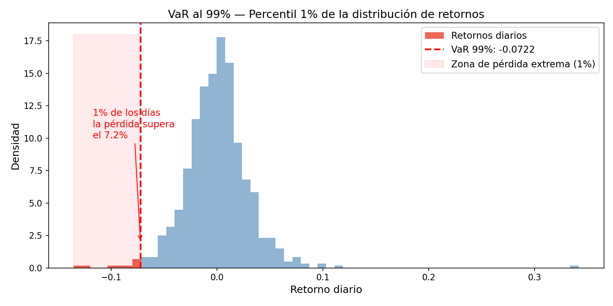
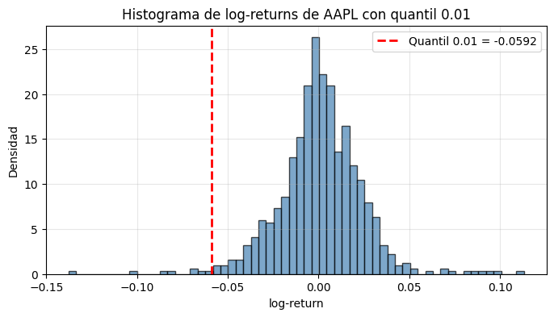
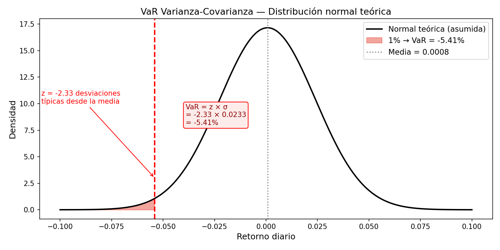
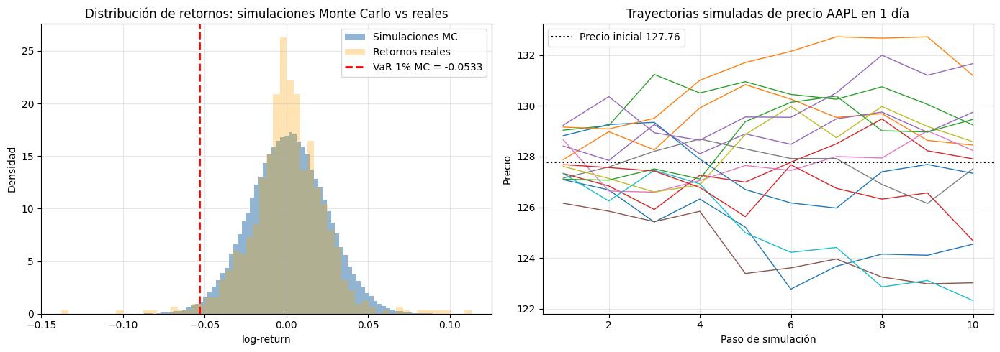
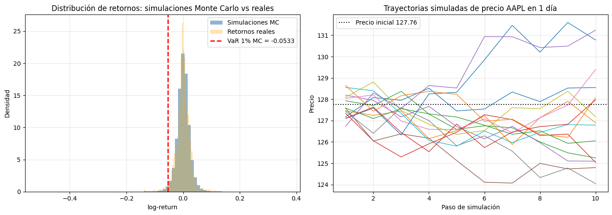

# Cómo se calcula el VaR

El VaR es siempre un **cuantil de la distribución de pérdidas** al nivel de confianza elegido. Lo que cambia entre métodos es cómo construyes esa distribución.



## Cómo leer el resultado: `quantile(0.01)` → -5.75%

`quantile(0.01)` mira solo la **cola izquierda** — el 1% peor de los retornos históricos. No miras la cola derecha porque el riesgo es la pérdida, no la ganancia.

Lo que dice ese -5.75%: el 1% de los días históricos tuvo retornos ≤ -5.75%. El 99% de los días tuvo retornos > -5.75%. El VaR es ese punto de corte.

## Nomenclatura: ¿VaR al 99% o al 1%?

Es una ambigüedad que confunde habitualmente. Son dos formas de nombrar el mismo número:

- **Por nivel de confianza**: VaR al 99% → en el 99% de los casos no superas esa pérdida
- **Por nivel de significancia** (la cola): VaR al 1% → estás mirando el percentil 1

`quantile(0.01)` = VaR al **99% de confianza** = VaR al **1% de significancia**. Cuando veas `VaR_95` en código, verifica cuál de los dos están usando — lo normal es que se refiera al nivel de confianza (95%), que corresponde a `quantile(0.05)`.

## Método 1 — Simulación histórica

Sin asumir distribución. Se usan retornos reales pasados, se ordenan, y el VaR es el percentil correspondiente:

```python
VaR_99 = s.quantile(0.01)
```


Captura fat tails y asimetría automáticamente porque los datos históricos ya los contienen. Limitación: asume que el futuro se parece al pasado; y el percentil 1 puede estar mal estimado si la ventana histórica es corta o no ha vivido escenarios extremos.

## Método 2 — Varianza-covarianza (paramétrico)

Asumes que los retornos son normales y calculas el VaR analíticamente:

$$\text{VaR} = V \cdot \sigma_p \cdot Z_\alpha$$

- $V$: valor del portfolio
- $\sigma_p$: desviación típica del portfolio
- $Z_\alpha$: cuantil de la normal estándar (95% → 1.645; 99% → 2.326)

```python
VaR = norm.ppf(0.01, mean, std)
```

**Ventajas frente al histórico:**

1. **No necesitas historial largo.** El histórico depende de que hayas vivido escenarios extremos en tu ventana de datos. Con varianza-covarianza solo necesitas media y std.

2. **Es analítico y estable.** El percentil 1 histórico puede saltar mucho si entra o sale un día de crash de tu ventana. La normal es más suave y estable en el tiempo.

3. **Escala fácil a portfolios** — esta es la razón más importante. Para un portfolio de N activos, el histórico necesita que todos los activos hayan coexistido en el mismo periodo. El varianza-covarianza solo necesita la matriz de covarianzas, y el VaR del portfolio se calcula analíticamente:

```python
var_portfolio = z * np.sqrt(w.T @ cov_matrix @ w)
```

**Problema**: subestima el riesgo con fat tails — asume normalidad cuando los retornos reales no la cumplen.

## Método 3 — Monte Carlo

Simulas miles de retornos futuros posibles desde la distribución que tú elijas, y coges el percentil 1 de esas simulaciones.

```python
simulations = stats.t.rvs(df=nu, loc=mean, scale=std, size=100_000)
VaR_99 = np.percentile(simulations, 1)
```
Con simulación de distribución normal:

Con simulación de t-student:


**Ventajas:**
- Flexible: puedes simular cualquier distribución (t-Student, GARCH, saltos...)
- Escala bien a portfolios con correlaciones complejas
- No depende de haber vivido los escenarios extremos en el historial

**Desventajas:**
- Su calidad depende totalmente de lo bien que modeles la distribución de partida — *garbage in, garbage out*
- Si simulas una normal, es varianza-covarianza con pasos extra
- Computacionalmente caro
- Difícil de explicar y auditar en entornos regulatorios

## Método 4 — EVT (Teoría del Valor Extremo)

Los tres métodos anteriores modelan toda la distribución de retornos. EVT hace algo distinto: **modela solo la cola**, donde ocurren las pérdidas graves, sin asumir nada sobre el centro de la distribución.

El resultado teórico clave: bajo ciertas condiciones, los valores extremos de *cualquier* distribución convergen a una de solo tres familias posibles. En finanzas siempre aparece la misma — colas gruesas (Fréchet) — equivalente a una t-Student con pocos grados de libertad.

Hay dos implementaciones prácticas:

**POT (Peaks Over Threshold):** se elige un umbral $U$ y se modelan solo las observaciones que lo superan. Las excedencias siguen una **GPD** (Generalised Pareto Distribution). El VaR se calcula como:

$$\text{VaR}_{\text{POT}} = U + \frac{\hat{\sigma}}{\hat{\xi}}\left[\left(\frac{N}{N_U}\alpha\right)^{-\hat{\xi}} - 1\right]$$

**Hill (estimador no paramétrico):** alternativa más simple, aplicable solo a colas gruesas. Ordena las excedencias y estima el parámetro de forma $\xi$ promediando los logaritmos de los ratios entre valores extremos consecutivos:

$$\text{VaR}_{\text{Hill}} = \tilde{y}_{(k)} \cdot \left(\frac{N}{N_U}\alpha\right)^{-\hat{\xi}}$$

En ambos casos, $\hat{\xi}$ es el parámetro que controla el grosor de la cola. En retornos financieros típicos, $\hat{\xi} \approx 0.1$–$0.4$.

**Ventajas:**
- Estadísticamente válido para cuantiles muy extremos (99.9%+) donde los demás métodos fallan
- No asume ninguna distribución para el centro de los datos
- La evidencia empírica muestra que supera a todos los otros métodos a medida que te adentras más en la cola

**Desventajas:**
- Asume datos i.i.d. — en retornos financieros hay que filtrar primero con GARCH, extraer los residuos estandarizados, y aplicar EVT sobre esos residuos
- La elección del umbral $U$ en POT es subjetiva y crítica: demasiado bajo introduce sesgo, demasiado alto deja pocas observaciones
- Para VaR al 95%–97.5%, la t-Student o el histórico son igual de buenos — EVT solo gana claramente en cuantiles muy extremos

## Escalado temporal

$$\text{VaR}_{n\text{ días}} = \text{VaR}_{1\text{ día}} \times \sqrt{n}$$

Asume retornos i.i.d. — supuesto que falla en periodos de estrés.

## Conexión con el análisis de distribución (→ respuesta_001, respuesta_002)

El análisis Normal vs t-Student no es un ejercicio previo independiente: es el prerequisito del VaR. Si se asume normalidad con datos que tienen fat tails, el VaR paramétrico subestima la pérdida real. La elección de t-Student justifica usar Monte Carlo con la distribución calibrada, que es el método más honesto dado lo que muestran los datos de Apple.
